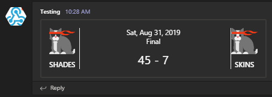
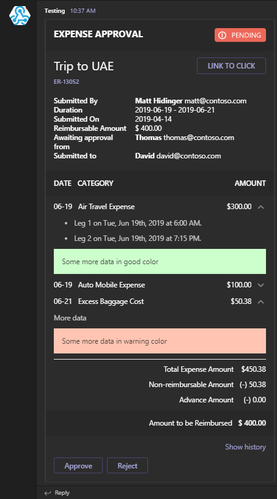
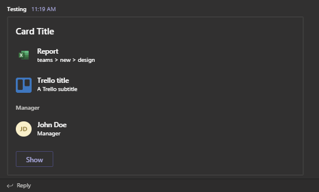
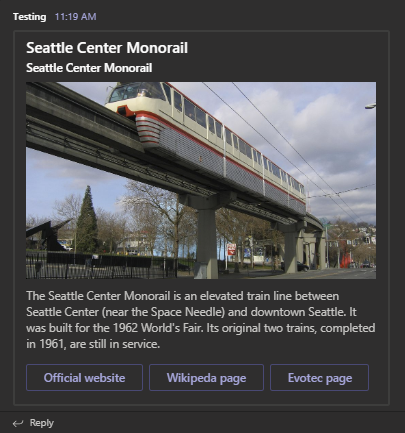

<p align="center">
  <a href="https://dev.azure.com/evotecpl/PSTeams/_build/latest?definitionId=3"></a>
  <a href="https://www.powershellgallery.com/packages/PSTeams"></a>
  <a href="https://www.powershellgallery.com/packages/PSTeams"></a>
  <a href="https://github.com/EvotecIT/PSTeams"></a>
</p>

<p align="center">
  <a href="https://www.powershellgallery.com/packages/PSTeams"></a>
  <a href="https://github.com/EvotecIT/PSTeams"></a>
  <a href="https://github.com/EvotecIT/PSTeams"></a>
  <a href="https://www.powershellgallery.com/packages/PSTeams"></a>
</p>

<p align="center">
  <a href="https://twitter.com/PrzemyslawKlys"></a>
  <a href="https://evotec.xyz/hub"></a>
  <a href="https://www.linkedin.com/in/pklys"></a>
</p>

# PSTeams - PowerShell Module

[PSTeams](https://evotec.xyz/hub/scripts/psteams-powershell-module/) is a **PowerShell Module** working on **Windows** / **Linux** and **Mac**.
It allows sending notifications to _Microsoft Teams_ via **WebHook Notifications**. It's pretty flexible and provides a bunch of options.
Initially it only supported one sort of `Office 365 Connector Card` but since version `2.X.X` it supports `Adaptive Cards`, `Hero Cards`, `List Cards` and `Thumbnail Cards`.
All those new cards have their own cmdlets and the old version of creating Teams Cards stays as is for compatibility reasons.
The most fun you will get from playing with `Adaptive Cards`, but rest has their use case.

## Links/Blogs

While I didn't spent much time creating WIKI, working on `Get-Help` documentation, I did write 4 articles that should help you get started.
First 3 articles are for version 0.X.X-1.X.X, and last one is small introduction to new versionF.

- [x] [PSTeams – PowerShell Module](https://evotec.xyz/hub/scripts/psteams-powershell-module/)
- [x] [PSTeams – Send notifications to MS Teams from Mac / Linux or Windows](https://evotec.xyz/psteams-send-notifications-to-ms-teams-from-mac-linux-or-windows/)
- [x] [Sending Messages to Microsoft Teams from PowerShell just got easier and better](https://evotec.xyz/sending-to-microsoft-teams-from-powershell-just-got-easier-and-better/)
- [x] [Introducing PSTeams 2.0 – Support for Adaptive Cards, Hero Cards, List Cards and Thumbnail Cards](https://evotec.xyz/introducing-psteams-2-0-support-for-adaptive-cards-hero-cards-list-cards-and-thumbnail-cards/)

## Support This Project

If you find this project helpful, please consider supporting its development.
Your sponsorship will help the maintainers dedicate more time to maintenance and new feature development for everyone.

It takes a lot of time and effort to create and maintain this project.
By becoming a sponsor, you can help ensure that it stays free and accessible to everyone who needs it.

To become a sponsor, you can choose from the following options:

 - [Become a sponsor via GitHub Sponsors :heart:](https://github.com/sponsors/PrzemyslawKlys)
 - [Become a sponsor via PayPal :heart:](https://paypal.me/PrzemyslawKlys)

Your sponsorship is completely optional and not required for using this project.
We want this project to remain open-source and available for anyone to use for free,
regardless of whether they choose to sponsor it or not.

If you work for a company that uses our .NET libraries or PowerShell Modules,
please consider asking your manager or marketing team if your company would be interested in supporting this project.
Your company's support can help us continue to maintain and improve this project for the benefit of everyone.

Thank you for considering supporting this project!

## Supported Cards

While `WebHook Notifications` in theory only support `Office 365 Connector Card` it's possible to do more than that.

- Supported in 0.X.0 - 1.0.X
  - [x] [Office 365 Connector Card](https://docs.microsoft.com/en-us/microsoftteams/platform/task-modules-and-cards/cards/cards-reference#office-365-connector-card) - The Office 365 Connector card provides a flexible layout with multiple sections, fields, images, and actions. This card encapsulates a connector card so that it can be used by bots. See the notes section for differences between connector cards and the O365 card.
- Supported in 2.X.X
  - [x] [AdaptiveCard](https://docs.microsoft.com/en-us/microsoftteams/platform/task-modules-and-cards/cards/cards-reference#adaptive-card)
  - [x] [List Cards](https://docs.microsoft.com/en-us/microsoftteams/platform/task-modules-and-cards/cards/cards-reference#list-card)
  - [x] [Hero Cards](https://docs.microsoft.com/en-us/microsoftteams/platform/task-modules-and-cards/cards/cards-reference#hero-card)
  - [x] [Thumbnail Cards](https://docs.microsoft.com/en-us/microsoftteams/platform/task-modules-and-cards/cards/cards-reference#thumbnail-card)

Below you can find how to send them and what they display.
You should be aware that while I've added some features, not all of them will work in Teams such as submitting data, or using inputs (they may display data but not really do anything).
It's still **work in progress** and things may change and get new features.

### Adaptive cards

Adaptive Cards are most advanced cards. There's lots of options available. Make sure to review:

- [Adaptive Card Samples](https://github.com/EvotecIT/PSTeams/tree/master/Examples/Adaptive%20Card%20Samples)
- [Adaptive Card Playground](https://github.com/EvotecIT/PSTeams/tree/master/Examples/Adaptive%20Card%20Samples)

Here's some code / output:

```powershell
New-AdaptiveCard -Uri $Env:TEAMSPESTERID -VerticalContentAlignment center {
    New-AdaptiveContainer {
        New-AdaptiveColumnSet {
            New-AdaptiveColumn {
                New-AdaptiveImage -Url "https://adaptivecards.io/content/cats/3.png" -Size Medium -AlternateText "Shades cat team emblem" -HorizontalAlignment Center
                New-AdaptiveTextBlock -Weight Bolder -Text 'SHADES' -HorizontalAlignment Center
            } -Width Auto
            New-AdaptiveColumn {
                New-AdaptiveTextBlock -Text "Sat, Aug 31, 2019" -HorizontalAlignment Center -Wrap
                New-AdaptiveTextBlock -Text "Final" -Spacing None -HorizontalAlignment Center
                New-AdaptiveTextBlock -Text "45 - 7" -HorizontalAlignment Center -Size ExtraLarge
            } -Width Stretch -Separator -Spacing Medium
            New-AdaptiveColumn {
                New-AdaptiveImage -Url "https://adaptivecards.io/content/cats/2.png" -Size Medium -HorizontalAlignment Center -AlternateText "Skins cat team emblem"
                New-AdaptiveTextBlock -Weight Bolder -Text 'SKINS' -HorizontalAlignment Center
            } -Width Auto -Separator -Spacing Medium
        }
    }
} -Speak 'The Seattle Seahawks beat the Carolina Panthers 40-7'
```

Output



Or something more advanced with hidden data, multiple actions and so on:

```powershell
New-AdaptiveCard -Uri $Env:TEAMSPESTERID {
    New-AdaptiveContainer -Style Emphasis -Bleed {
        New-AdaptiveColumnSet {
            New-AdaptiveColumn -Width Stretch {
                New-AdaptiveTextBlock -Text '**EXPENSE APPROVAL**' -Weight Bolder -Size Large
            }
            New-AdaptiveColumn -Width Auto {
                New-AdaptiveImage -Url "https://adaptivecards.io/content/pending.png" -AlternateText 'Pending' -HeightInPixels 30 #-HorizontalAlignment Right
            }
        }
    }

    New-AdaptiveContainer {
        New-AdaptiveColumnSet {
            New-AdaptiveColumn -Width Stretch {
                New-AdaptiveTextBlock -Text 'Trip to UAE' -Wrap -Size ExtraLarge
            }
            New-AdaptiveColumn -Width Auto {
                New-AdaptiveActionSet {
                    New-AdaptiveAction -Title 'LINK TO CLICK' -ActionUrl 'https://adaptivecards.io'
                }
            }
        }
    }
    New-AdaptiveTextBlock -Text "[ER-13052](https://adaptivecards.io)" -Spacing Small -Size Small -Weight Bolder -Color Accent

    New-AdaptiveFactSet -Spacing Large {
        New-AdaptiveFact -Title "Submitted By" -Value "**Matt Hidinger**  matt@contoso.com"
        New-AdaptiveFact -Title "Duration" -Value "2019-06-19 - 2019-06-21"
        New-AdaptiveFact -Title "Submitted On" -Value "2019-04-14"
        New-AdaptiveFact -Title "Reimbursable Amount" -Value '$ 400.00'
        New-AdaptiveFact -Title "Awaiting approval from" -Value "**Thomas**  thomas@contoso.com"
        New-AdaptiveFact -Title "Submitted to" -Value "**David**  david@contoso.com"
    }

    New-AdaptiveContainer -Style Emphasis -Spacing Large {
        New-AdaptiveColumnSet {
            New-AdaptiveColumn {
                New-AdaptiveTextBlock -Text 'DATE' -Weight Bolder
            } -Width Auto
            New-AdaptiveColumn {
                New-AdaptiveTextBlock -Text 'CATEGORY' -Weight Bolder
            } -Width Stretch
            New-AdaptiveColumn {
                New-AdaptiveTextBlock -Text 'AMOUNT' -Weight Bolder
            } -Width Auto
        }
    } -Bleed

    New-AdaptiveColumnSet {
        New-AdaptiveColumn -Width Auto -Spacing Medium {
            New-AdaptiveTextBlock -Text '06-19' -Wrap
        }
        New-AdaptiveColumn -Width Stretch {
            New-AdaptiveTextBlock -Text 'Air Travel Expense' -Wrap
        }
        New-AdaptiveColumn -Width Auto {
            New-AdaptiveTextBlock -Text '$300.00' -Wrap
        }
        # Special column with Action and hidden items
        # Notice ActionTargetElement which triggers automatically ToggleVisibility for those mentioned
        New-AdaptiveColumn -Spacing Small -VerticalContentAlignment Center -Width Auto {
            New-AdaptiveImage -Id 'chevronDown1' -Url "https://adaptivecards.io/content/down.png" -WidthInPixels 20 -AlternateText "Details collapsed"
            New-AdaptiveImage -Id 'chevronUp1' -Url "https://adaptivecards.io/content/up.png" -WidthInPixels 20 -AlternateText "Details collapsed" -Hidden
        } -SelectActionTargetElement 'cardContent1', 'chevronDown1', 'chevronUp1'
    }

    # Notice this will be hidden initially and shown with the action from above
    New-AdaptiveContainer -Hidden -Id 'cardContent1' {
        New-AdaptiveTextBlock -Text '* Leg 1 on Tue, Jun 19th, 2019 at 6:00 AM.' -Subtle -Wrap
        New-AdaptiveTextBlock -Text '* Leg 2 on Tue, Jun 19th, 2019 at 7:15 PM.' -Subtle -Wrap
        New-AdaptiveContainer -Style Good {
            # This should be an input type, but not yet added - not sure if it makes sense, as inputs are not working for webhooks
            New-AdaptiveTextBlock -Text 'Some more data in good color' -Subtle -Wrap
        }
    }

    New-AdaptiveColumnSet {
        New-AdaptiveColumn -Width Auto -Spacing Medium {
            New-AdaptiveTextBlock -Text '06-19' -Wrap
        }
        New-AdaptiveColumn -Width Stretch {
            New-AdaptiveTextBlock -Text 'Auto Mobile Expense' -Wrap
        }
        New-AdaptiveColumn -Width Auto {
            New-AdaptiveTextBlock -Text '$100.00' -Wrap
        }
        # Special column with Action and hidden items
        # Notice ActionTargetElement which triggers automatically ToggleVisibility for those mentioned
        New-AdaptiveColumn -Spacing Small -VerticalContentAlignment Center -Width Auto {
            New-AdaptiveImage -Id 'chevronDown2' -Url "https://adaptivecards.io/content/down.png" -WidthInPixels 20 -AlternateText "Details collapsed"
            New-AdaptiveImage -Id 'chevronUp2' -Url "https://adaptivecards.io/content/up.png" -WidthInPixels 20 -AlternateText "Details collapsed" -Hidden
        } -SelectActionTargetElement 'cardContent2', 'chevronDown2', 'chevronUp2'
    }

    # Notice this will be hidden initially and shown with the action from above
    New-AdaptiveContainer -Hidden -Id 'cardContent2' {
        New-AdaptiveTextBlock -Text '* Contoso Car Rentrals, Tues 6/19 at 7:00 AM' -Subtle -Wrap
        New-AdaptiveContainer -Style Warning {
            # This should be an input type, but not yet added - not sure if it makes sense, as inputs are not working for webhooks
            New-AdaptiveTextBlock -Text 'Some more data in warning color' -Subtle -Wrap
        }
    }

    New-AdaptiveColumnSet {
        New-AdaptiveColumn -Width Auto -Spacing Medium {
            New-AdaptiveTextBlock -Text '06-21' -Wrap
        }
        New-AdaptiveColumn -Width Stretch {
            New-AdaptiveTextBlock -Text 'Excess Baggage Cost' -Wrap
        }
        New-AdaptiveColumn -Width Auto {
            New-AdaptiveTextBlock -Text '$50.38' -Wrap
        }
        # Special column with Action and hidden items
        # Notice ActionTargetElement which triggers automatically ToggleVisibility for those mentioned
        New-AdaptiveColumn -Spacing Small -VerticalContentAlignment Center -Width Auto {
            New-AdaptiveImage -Id 'chevronDown3' -Url "https://adaptivecards.io/content/down.png" -WidthInPixels 20 -AlternateText "Details collapsed"
            New-AdaptiveImage -Id 'chevronUp3' -Url "https://adaptivecards.io/content/up.png" -WidthInPixels 20 -AlternateText "Details collapsed" -Hidden
        } -SelectActionTargetElement 'cardContent3', 'chevronDown3', 'chevronUp3'
    }

    # Notice this will be hidden initially and shown with the action from above
    New-AdaptiveContainer -Hidden -Id 'cardContent3' {
        New-AdaptiveTextBlock -Text 'More data' -Subtle -Wrap
        New-AdaptiveContainer -Style Attention {
            # This should be an input type, but not yet added - not sure if it makes sense, as inputs are not working for webhooks
            New-AdaptiveTextBlock -Text 'Some more data in warning color' -Subtle -Wrap
        }
    }

    New-AdaptiveColumnSet -Spacing Large -Separator {
        New-AdaptiveColumn {
            New-AdaptiveTextBlock -Text "Total Expense Amount" -Wrap -HorizontalAlignment Right
            New-AdaptiveTextBlock -Text 'Non-reimbursable Amount' -Wrap -HorizontalAlignment Right
            New-AdaptiveTextBlock -Text 'Advance Amount' -Wrap -HorizontalAlignment Right
        } -Width Stretch
        New-AdaptiveColumn {
            New-AdaptiveTextBlock -Text '$450.38' -HorizontalAlignment Right
            New-AdaptiveTextBlock -Text '(-) 50.38' -HorizontalAlignment Right
            New-AdaptiveTextBlock -Text '(-) 0.00' -HorizontalAlignment Right
        } -Width Auto
    }

    New-AdaptiveContainer -Style Emphasis {
        New-AdaptiveColumnSet {
            New-AdaptiveColumn {
                New-AdaptiveTextBlock -Text 'Amount to be Reimbursed' -Wrap -HorizontalAlignment Right
            } -Width Stretch
            New-AdaptiveColumn {
                New-AdaptiveTextBlock -Text '$ 400.00' -Weight Bolder
            } -Width Auto
        }
    } -Bleed

    New-AdaptiveColumnSet {
        New-AdaptiveColumn -VerticalContentAlignment Center -WidthInWeight 1 {
            New-AdaptiveTextBlock -Text 'Show history' -Wrap -HorizontalAlignment Right -Id 'showHistory' -Color Accent
            New-AdaptiveTextBlock -Text 'Hide history' -Wrap -HorizontalAlignment Right -Id 'hideHistory' -Color Accent -Hidden
        } -SelectActionTargetElement 'cardContent4', 'showHistory', 'hideHistory'
    }

    New-AdaptiveContainer -id 'cardContent4' -Hidden {
        New-AdaptiveTextBlock -Text '* Expense submitted by **Matt Hidinger** on Mon, Jul 15, 2019' -Subtle -Wrap
        New-AdaptiveTextBlock -Text '* Expense approved by **Thomas** on Mon, Jul 15, 2019' -Subtle -Wrap
    }
} -Action {
    # This won't really work as submit doesn't work in
    New-AdaptiveAction -Type Action.Submit -Title 'Approve'
    New-AdaptiveAction -Type Action.Submit -Title 'Reject'
} -Verbose
```

Output



### List Cards

Here's a simple way to send List Cards to Teams using WebHook

- List Items do not support `tapType` `imBack`. When clicked action is not taken
- List Items do not support `tapAction`. It's there, but doesn't work.
- List Items do not support type `file`. It displays, but no action is taken. It's better to use `resultItem`

Code

```powershell
New-CardList {
    New-CardListItem -Type file -Title 'Report' -SubTitle 'teams > new > design' -TapType openUrl -TapValue "https://contoso.sharepoint.com/teams/new/Shared%20Documents/Report.xlsx" -TapAction editOnline
    New-CardListItem -Type resultItem -Title 'Report' -SubTitle 'teams > new > design' -TapType openUrl -TapValue "https://contoso.sharepoint.com/teams/new/Shared%20Documents/Report.xlsx"
    New-CardListItem -Type resultItem -Title 'Trello title' -SubTitle 'A Trello subtitle' -TapType openUrl -TapValue "http://trello.com" -Icon "https://cdn2.iconfinder.com/data/icons/social-icons-33/128/Trello-128.png"
    New-CardListItem -Type section -Title 'Manager'
    New-CardListItem -Type person -Title "John Doe" -SubTitle 'Manager' -TapType imBack -TapValue "JohnDoe@contoso.com" -TapAction whois
    New-CardListButton -Type openUrl -Title 'Show' -Value 'https://evotec.xyz'
} -Uri $Env:TEAMSPESTERID -Title 'Card Title'
```

Output



### Hero Cards

Here's a simple way to send List Cards to Teams using WebHook

- Hero Buttons (`New-HeroButton`)do not support button type other then `openUrl`
  - When using Type `imBack` action is not taken
  - When using Type `file` button is not displayed
- Using more than 3 buttons causes carousel for card. I've blocked it out, as all that happens is text is doubled/image is doubled but buttons don't show up over 3

Code

```powershell
New-HeroCard -Title 'Seattle Center Monorail' -SubTitle 'Seattle Center Monorail' -Text "The Seattle Center Monorail is an elevated train line between Seattle Center (near the Space Needle) and downtown Seattle. It was built for the 1962 World's Fair. Its original two trains, completed in 1961, are still in service." {
    New-HeroImage -Url 'https://upload.wikimedia.org/wikipedia/commons/thumb/4/49/Seattle_monorail01_2008-02-25.jpg/1024px-Seattle_monorail01_2008-02-25.jpg'
    New-HeroButton -Type openUrl -Title 'Official website' -Value 'https://www.seattlemonorail.com'
    New-HeroButton -Type openUrl -Title 'Wikipeda page' -Value 'https://www.seattlemonorail.com'
    New-HeroButton -Type openUrl -Title 'Evotec page' -Value 'https://www.evotec.xyz'
} -Uri $Env:TEAMSPESTERID
```

Output



### Thumbnail Cards

Here's a simple way to send Thumbnail Cards to Teams using WebHook

- Images are not supported in buttons, you can send them but it's not displayed
- imBack action is not supported in buttons, you can send them but once you click it an notification message appears

Code

```powershell
New-ThumbnailCard -Title 'Bender' -SubTitle "tale of a robot who dared to love" -Text "Bender Bending Rodríguez is a main character in the animated television series Futurama. He was created by series creators Matt Groening and David X. Cohen, and is voiced by John DiMaggio" {
    New-ThumbnailImage -Url 'https://upload.wikimedia.org/wikipedia/en/a/a6/Bender_Rodriguez.png' -AltText "Bender Rodríguez"
    New-ThumbnailButton -Type imBack -Title 'Thumbs Up' -Value 'I like it' -Image "http://moopz.com/assets_c/2012/06/emoji-thumbs-up-150-thumb-autox125-140616.jpg"
    New-ThumbnailButton -Type openUrl -Title 'Thumbs Down' -Value 'https://evotec.xyz'
    New-ThumbnailButton -Type openUrl -Title 'I feel luck' -Value 'https://www.bing.com/images/search?q=bender&qpvt=bender&qpvt=bender&qpvt=bender&FORM=IGRE'
} -Uri $Env:TEAMSPESTERID
```

Output


### Office 365 Connector Card - pre 2.X.X version

```powershell
$TeamsID = 'YourCodeGoesHere'
$Button1 = New-TeamsButton -Name 'Visit English Evotec Website' -Link "https://evotec.xyz"
$Fact1 = New-TeamsFact -Name 'PS Version' -Value "**$($PSVersionTable.PSVersion)**"
$Fact2 = New-TeamsFact -Name 'PS Edition' -Value "**$($PSVersionTable.PSEdition)**"
$Fact3 = New-TeamsFact -Name 'OS' -Value "**$($PSVersionTable.OS)**"
$CurrentDate = Get-Date
$Section = New-TeamsSection `
    -ActivityTitle "**PSTeams**" `
    -ActivitySubtitle "@PSTeams - $CurrentDate" `
    -ActivityImage Add `
    -ActivityText "This message proves PSTeams Pester test passed properly." `
    -Buttons $Button1 `
    -ActivityDetails $Fact1, $Fact2, $Fact3
Send-TeamsMessage `
    -URI $TeamsID `
    -MessageTitle 'PSTeams - Pester Test' `
    -MessageText "This text won't show up" `
    -Color DodgerBlue `
    -Sections $Section
```

- When executed from Linux


- When executed from Windows


- When executed from MacOS


- And this is more advanced option sent by [PSWinReporting](https://evotec.xyz/hub/scripts/pswinreporting-powershell-module/)


## Installing/Updating on Windows / Linux / MacOS

Installation doesn't require administrative rights. You can install it using following:

```powershell
Install-Module PSTeams
```

But if you don't have administrative rights on your machine:

```powershell
Install-Module PSTeams -Scope CurrentUser
```

To update

```powershell
Update-Module -Name PSTeams
```

That's it. Whenever there's a new version you simply run the command and you can enjoy it.
Remember, that you may need to close, reopen the PowerShell session if you have already used the module before updating it.
**The important thing** is if something works for you on production, keep using it till you test the new version on a test computer.
I do changes that may not be big, but big enough that auto-update will break your code. For example, small rename to a parameter and your code stops working! Be responsible!
Dependencies: **PSSharedGoods**, **PSWriteColor** and **Connectimo** are only used during development. When published to PSGallery / Releases it's a merged release without any dependencies.

## Documentation for Message Cards (for development)

This module uses Message Cards to send information to Teams. You can find out what is supported in [Legacy actionable message card reference](https://docs.microsoft.com/en-us/outlook/actionable-messages/message-card-reference) just in case you would like to help out with development of this module.

Additional links:

- <https://docs.microsoft.com/en-us/microsoftteams/platform/concepts/cards/cards-format>
- <https://docs.microsoft.com/en-us/outlook/actionable-messages/message-card-reference>


```powershell
Send-TeamsMessage -Verbose {
    New-TeamsSection -ActivityTitle "**Elon Musk**" -ActivitySubtitle "@elonmusk - 9/12/2016 at 5:33pm" -ActivityImageLink "https://pbs.twimg.com/profile_images/782474226020200448/zDo-gAo0.jpg" -ActivityText "Climate change explained in comic book form by xkcd xkcd.com/1732"
    New-TeamsSection -ActivityTitle "**Mark Knopfler**" -ActivitySubtitle "@MarkKnopfler - 9/12/2016 at 1:12pm" -ActivityImageLink "https://pbs.twimg.com/profile_images/1042367841117384704/YvrqQiBK_400x400.jpg" -ActivityText "Mark Knopfler features on B.B King's all-star album of Blues greats, released on this day in 2005..."
    New-TeamsSection -ActivityTitle "**Elon Musk**" -ActivitySubtitle "@elonmusk - 9/12/2016 at 5:33pm" -ActivityImageLink "https://pbs.twimg.com/profile_images/782474226020200448/zDo-gAo0.jpg" -ActivityText "Climate change explained in comic book form by xkcd xkcd.com/1732"
} -Uri $TeamsID -MessageSummary 'Tweet'
```
